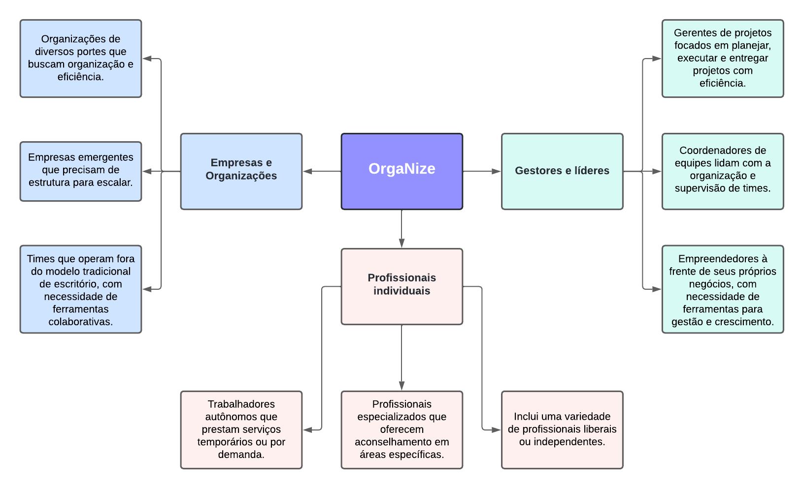

# Introdução

Em um ambiente corporativo, a organização e a gestão eficiente de tarefas são essenciais para o sucesso. Muitas empresas enfrentam desafios relacionados à desorganização e à má gestão de atividades, o que pode comprometer a produtividade e os resultados. Pensando nisso, o OrgaNize foi desenvolvido para oferecer uma solução eficiente, permitindo que equipes organizem, priorizem e acompanhem suas tarefas de forma estruturada, melhorando o fluxo de trabalho e a tomada de decisões.

## Problema

Entre as principais dificuldades estão:

- **Falta de Priorização**: Sem um sistema claro, as equipes podem focar em atividades secundárias enquanto tarefas críticas ficam pendentes.

- **Perda de Prazo**: A desorganização pode levar ao esquecimento de prazos importantes, afetando a reputação da empresa e a satisfação do cliente.

- **Sobrecarga de Trabalho**: A falta de distribuição clara de tarefas pode gerar desequilíbrios na carga de trabalho e aumentar o risco de burnout.

- **Falta de Visibilidade**: Gestores podem ter dificuldades para acompanhar o progresso dos projetos e a tomada de decisões.

- **Redução da Produtividade**: A ausência de um sistema estruturado pode levar a distrações e perda de tempo.

<!-- > **Links Úteis**:
>
> - [Objetivos, Problema de pesquisa e Justificativa](https://medium.com/@versioparole/objetivos-problema-de-pesquisa-e-justificativa-c98c8233b9c3)
> - [Matriz Certezas, Suposições e Dúvidas](https://medium.com/educa%C3%A7%C3%A3o-fora-da-caixa/matriz-certezas-suposi%C3%A7%C3%B5es-e-d%C3%BAvidas-fa2263633655)
> - [Brainstorming](https://www.euax.com.br/2018/09/brainstorming/) -->

## Objetivos

O aplicativo OrgaNize propõe um sistema de "to-do" eficiente para mitigar esses problemas, organizando tarefas, melhorando a comunicação e garantindo um gerenciamento eficaz.

### Principais objetivo

- **Organização de Tarefas** – Proporcionar uma estrutura eficiente para a criação, categorização e acompanhamento de tarefas.

- **Melhoria da Comunicação** – Facilitar a interação entre usuários para garantir alinhamento e clareza nas responsabilidades.

- **Aprimoramento da Produtividade** – Reduzir a sobrecarga e otimizar o tempo dos usuários ao estruturar melhor as demandas.

- **Gerenciamento** – Permitir um controle mais preciso do fluxo de trabalho, prazos e prioridades.

- **Redução de Problemas Organizacionais** – Minimizar falhas na execução de tarefas e evitar retrabalho por meio de um sistema eficiente.

Esses objetivos garantem que o OrgaNize atenda às necessidades de seus usuários, promovendo eficiência e melhor gestão do tempo.

<!-- > **Links Úteis**:
>
> - [Objetivo geral e objetivo específico: como fazer e quais verbos utilizar](https://blog.mettzer.com/diferenca-entre-objetivo-geral-e-objetivo-especifico/) -->

## Justificativa

A gestão eficiente de tarefas e a comunicação clara são elementos essenciais para a produtividade em diversos contextos, sejam eles acadêmicos, profissionais ou pessoais. No entanto, a falta de organização pode resultar em atrasos, falhas na execução de atividades e dificuldades na priorização de demandas.

Diante desse cenário, o OrgaNize foi desenvolvido com o objetivo de otimizar a gestão de tarefas, proporcionando um sistema estruturado que facilita o acompanhamento de prazos, a definição de prioridades e a minimização de falhas organizacionais. A ferramenta visa aprimorar a comunicação entre os envolvidos e aumentar a produtividade, garantindo um gerenciamento mais eficiente e assertivo.

<!-- > **Links Úteis**:
>
> - [Como montar a justificativa](https://guiadamonografia.com.br/como-montar-justificativa-do-tcc/) -->

## Público-Alvo

O público-alvo abrange uma ampla gama de profissionais e organizações que buscam soluções para gestão, produtividade e colaboração. Eles podem ser classificados em três grandes grupos:

- **Empresas e Organizações**: Pequenas, médias e grandes empresas, incluindo startups em crescimento, equipes remotas e híbridas.
- **Gestores e Líderes**: Gerentes de projetos, coordenadores de equipes e empreendedores que necessitam de ferramentas e métodos para otimizar processos e melhorar a eficiência.
- **Profissionais Individuais**: Freelancers, consultores e profissionais autônomos que buscam soluções para organização, produtividade e gestão de tempo.

## Perfis dos Usuários

A aplicação será utilizada por diferentes perfis de usuários, cada um com características específicas em relação ao conhecimento prévio, relação com a tecnologia e estrutura hierárquica.

#### Usuário Experiente em Tecnologia

- Tem facilidade com plataformas digitais e sistemas de gestão.
- Costuma utilizar automação de processos e integração entre ferramentas.
- Possui autonomia para explorar novas funcionalidades.

#### Usuário Intermediário

- Tem conhecimento básico de ferramentas digitais, mas pode precisar de suporte inicial.
- Utiliza softwares de gestão de tarefas e produtividade regularmente.
- Pode necessitar de treinamentos ou documentação detalhada para uso avançado.

#### Usuário Iniciante ou Com Pouca Familiaridade com Tecnologia

- Prefere interfaces simples e intuitivas.
- Pode ter dificuldades em compreender recursos avançados.
- Precisa de um suporte mais estruturado, como tutoriais passo a passo.

#### Usuário em Posição de Liderança

- Encontra-se em níveis gerenciais ou de decisão.
- Busca relatórios, dashboards e insights estratégicos sobre produtividade e desempenho.
- Pode demandar personalizações específicas para a gestão de equipes.

#### Usuário Colaborador

- Participa ativamente na execução das atividades e tarefas.
- Precisa de ferramentas para organização do trabalho e comunicação eficiente com a equipe.
- Pode não estar envolvido diretamente na tomada de decisão.

## Mapa de Stakeholders:

<!-- > **Links Úteis**:
>
> - [Público-alvo](https://blog.hotmart.com/pt-br/publico-alvo/)
> - [Como definir o público alvo](https://exame.com/pme/5-dicas-essenciais-para-definir-o-publico-alvo-do-seu-negocio/)
> - [Público-alvo: o que é, tipos, como definir seu público e exemplos](https://klickpages.com.br/blog/publico-alvo-o-que-e/)
> - [Qual a diferença entre público-alvo e persona?](https://rockcontent.com/blog/diferenca-publico-alvo-e-persona/) -->
